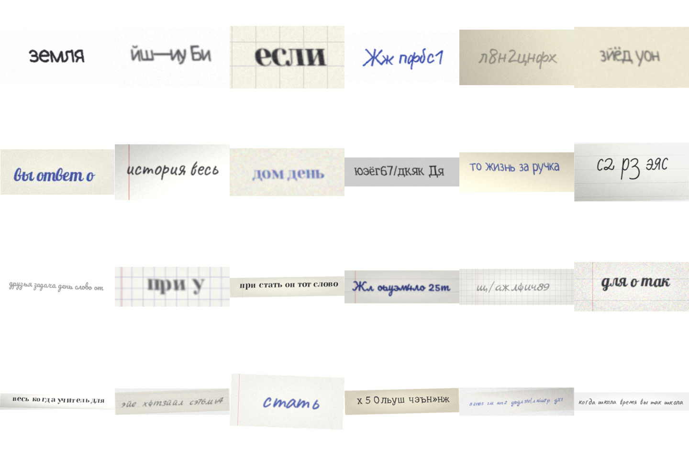

# Распознавание рукописного текста (русский TrOCR)

Второй этап пайплайна HTR: детекция (`../detection`) находит строки → **этот проект
распознаёт текст** в каждой строке. Цель — дообучить TrOCR под русский рукописный
почерк.

Главная проблема: реальных выровненных пар «изображение строки → текст» для русского
мало (датасет HWR200 даёт страницы + `full_text`, но без построчной разметки). Решение —
**генерировать рукописные строки синтетически на лету во время обучения** (шрифты +
фоны тетрадей + аугментации) и валидироваться на реальных строках. Это и есть ядро
проекта — пакет [`src/synth`](src/synth).



---

## Статус

| Компонент | Статус |
|---|---|
| **Генератор синтетики `src/synth` (Tier 1: шрифты)** | ✅ готов, рабочий |
| `scripts/fetch_fonts.py`, `scripts/demo_synth.py`, `notebooks/test_synth.ipynb` | ✅ |
| Эксперименты TrOCR (`notebooks/recognition.ipynb`, `htr.ipynb`) | перенесены сюда |
| torch-обвязка (`IterableDataset`, collator, метрики) + `train_recognition.py` | ⏭️ следующий шаг |
| Tier 2 (диффузия One-DM/DiffusionPen на кириллице) | 🔭 при выходе CER на плато |

---

## Быстрый старт

```bash
cd recognition
pip install -r requirements.txt

python scripts/fetch_fonts.py          # скачать стартовый набор кириллических рукописных шрифтов
python scripts/demo_synth.py           # превью-сетка assets/synth_preview.png + замер скорости
```

Использование в коде:

```python
import sys; sys.path.insert(0, ".")          # как в detection: импорт вида `from src...`
from src.synth import HandwrittenLineGenerator, SynthConfig, make_generator

gen = HandwrittenLineGenerator(SynthConfig())          # нужны шрифты в assets/fonts/
rng = make_generator(base_seed=42, worker_id=0, draw_index=0)
image, text = gen.sample(rng, step=10_000)             # (PIL.Image 384×384, "строка текста")
```

---

## Архитектура генератора (`src/synth`)

Чистый пакет без torch — тестируется и используется отдельно. Стиль повторяет
`detection/src/augmentation.py`: `@dataclass`-конфиги, albumentations с version-guard,
рендеринг на PIL. Каждый сэмпл собирается из сменных компонентов:

| Файл | Ответственность |
|---|---|
| [`config.py`](src/synth/config.py) | `SynthConfig` + под-конфиги (Corpus/Font/Render/Paper/Effects/Output) — все диапазоны и вероятности с комментариями |
| [`rng.py`](src/synth/rng.py) | worker-safe RNG (`SeedSequence`) + `lerp`/`scale_p` для curriculum |
| [`corpus.py`](src/synth/corpus.py) | `TextSampler`: реальный текст / word-salad / случайные глифы; длина и charset |
| [`fonts.py`](src/synth/fonts.py) | `FontBank`: пул TTF, проверка покрытия глифов (fontTools), кэш `ImageFont` |
| [`render.py`](src/synth/render.py) | `LineRenderer`: строка → RGBA-чернила с дрожанием базовой линии, наклоном, джиттером |
| [`backgrounds.py`](src/synth/backgrounds.py) | `PaperBackground`: цвет/волокна/виньетка + **линейка/клетка/поля** + кропы реальной бумаги |
| [`effects.py`](src/synth/effects.py) | `Compositor` (чернила→бумага) + `EffectsPipeline` (геометрия+фотометрия) |
| [`generator.py`](src/synth/generator.py) | `HandwrittenLineGenerator`: оркестратор, `sample()`, curriculum, `fit_to_square` |
| [`assets.py`](src/synth/assets.py) | сканирование шрифтов, кэш-манифест покрытия, пул реальной бумаги |

**Поток одного `sample(rng, step)`:**
`t = difficulty(step)` → текст (`corpus`) → шрифт (`fonts`, фильтр непокрытых символов) →
чернильный слой (`render`) → бумага (`backgrounds`) → композитинг (`effects.Compositor`) →
деградации (`effects.EffectsPipeline`) → letterbox в 384×384 под вход TrOCR.

### Curriculum (генерация «от простого к сложному»)

`difficulty(step) = min(step / warmup_steps, 1)` задаёт `t ∈ [0,1]`, который читает каждый
этап: при `t→0` — короткие чистые строки на белой бумаге со слабой фотометрией; при `t→1` —
полные длины, клетка/линейка, сильные искажения. Непрерывный аналог tier-ов
`none|standard|handwriting` из детекции. Отключается `SynthConfig(curriculum=False)`.

### Ключевые ручки `SynthConfig`

```python
SynthConfig(
    corpus=CorpusConfig(real_text_files=("data/ru_corpus.txt",),  # реальный текст домена
                        len_chars=(8, 48), p_real=.55, p_words=.30, p_random=.15),
    font=FontConfig(font_dirs=("assets/fonts",), min_glyph_coverage=.85),
    paper=PaperConfig(p_grid=.22, p_ruled=.30, real_paper_dir="assets/paper"),
    output=OutputConfig(proc_size=384, keep_aspect=True),         # letterbox, без сжатия аспекта
    warmup_steps=4000, seed=42,
)
```

Полный конфиг можно собирать из OmegaConf-узла через `build_synth_cfg(cfg.synth)`
(как `_build_*_cfg` в `detection/train.py`) — пригодится в `train_recognition.py`.

---

## Реальные данные (валидация и подмешивание)

Чекпойнты выбираем **только по реальному CER/WER**, синтетика — для валидации бессмысленна.

- [Cyrillic Handwriting Dataset (Kaggle)](https://www.kaggle.com/datasets/constantinwerner/cyrillic-handwriting-dataset) — ~73k строк русского рукописного, готовые пары строка→текст.
- [HKR (Handwritten Kazakh & Russian)](https://github.com/abdoelsayed2016/HKR_Dataset) — ~63k предложений, ~200 авторов (нужна заявка, некоммерческое использование).
- HWR200 — ваши страницы + `full_text`; построчные кропы можно получить детектором из `../detection`.
- Стартовый чекпойнт: [kazars24/trocr-base-handwritten-ru](https://huggingface.co/kazars24/trocr-base-handwritten-ru) (уже на кириллице) либо дообучение `microsoft/trocr-base-*`.

---

## Дорожная карта

1. **Tier 1 — шрифтовая синтетика (готово).** Бесконечные данные с идеальными метками,
   почти нулевая стоимость на GPU. Подтверждённый подход (статья [FbSTG](https://link.springer.com/chapter/10.1007/978-3-031-50320-7_8), +6% точности).
2. **Следующий шаг — обвязка обучения.** `SynthLineIterableDataset` (бесконечный,
   per-worker seeding через `make_generator`, `worker_init_fn` → `gen.warm_cache()`),
   `TrOCRCollator` (процессор + токенайзер, паддинг меток `-100`), `RealLineDataset` +
   смешивание synth↔real по расписанию, `metrics.py` (CER/WER на jiwer),
   `config_recognition.yaml` + `train_recognition.py` (OmegaConf + `Seq2SeqTrainer`,
   `max_steps` т.к. датасет бесконечный, eval только на реальных строках).
3. **Tier 2 — генеративный реализм.** Дообучить на кириллице One-DM / DiffusionPen / VATr
   и использовать как источник чернил за тем же интерфейсом `(PIL.Image, str)`. Эскалировать,
   когда реальный val-CER выйдет на плато и анализ ошибок покажет «разрыв стиля» (связный
   почерк, лигатуры). Дорого → обычно генерируют корпус офлайн, не на лету.

---

## Производительность и тюнинг

`scripts/demo_synth.py` печатает строки/с. Основная стоимость — по-глифовый рендер: длина
строки решает (короткие строки ~2× быстрее). Фолбэк-эффекты (без albumentations) медленнее
C-ускоренного albumentations на сервере. Ручки скорости: меньше `corpus.len_chars`,
`render.per_glyph_rot_deg=(0,0)`, `paper.use_cache_pool=True`, больше `num_workers`
(throughput линейно масштабируется — RNG декоррелирован по воркерам).

## Подводные камни (учтены в коде)

- **Покрытие кириллицы.** Многие «handwriting» шрифты — только латиница или только заглавные;
  ё/й/ъ/щ часто отсутствуют. `FontBank` проверяет покрытие (fontTools), отбраковывает слабые
  шрифты, а `FontEntry.filter` убирает непокрытые символы из строки И метки синхронно.
- **TrOCR 384×384.** Квадратный вход сжимает длинные строки. `output.keep_aspect=True` делает
  letterbox (`fit_to_square`) — применяйте ту же функцию к реальным кропам на инференсе.
  Держите строки короткими (`len_chars`), согласуйте гистограмму длин с реальными данными.
- **Двойная нормализация.** Генератор отдаёт uint8 RGB и НЕ нормализует — нормализует только
  процессор TrOCR.
